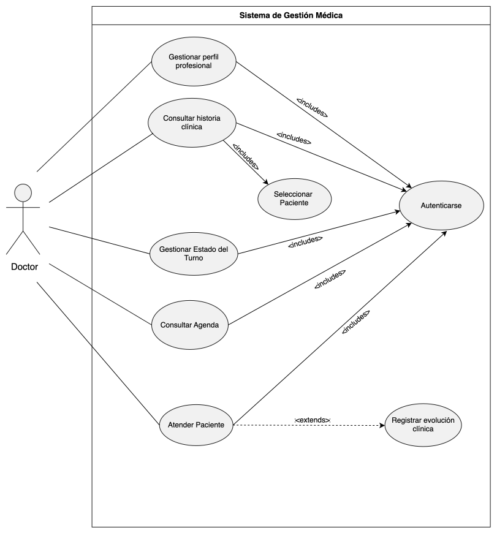

# Casos de Uso: Actor Paciente  

## Índice

| ID | Nombre | Descripción | Escenarios |
|----|--------|-------------|------------|
| CU-P-01 | Reservar turno | Permite reservar una cita médica seleccionando profesional, fecha y horario. | [Ver escenarios](./CU-P-01-reservar-turno.md) |
| CU-P-02 | Consultar turnos reservados | Permite visualizar los turnos registrados del paciente. | [Ver escenarios](./CU-P-02-consultar-turnos.md) |
| CU-P-03 | Cancelar turno reservado | Permite cancelar una cita previamente registrada. | [Ver escenarios](./CU-P-03-cancelar-turno.md) |
| CU-P-04 | Gestionar personas a cargo | Permite administrar personas asociadas al paciente. | [Ver escenarios](./CU-P-04-gestionar-personas.md) |
| CU-P-05 | Consultar profesionales disponibles | Permite consultar profesionales y horarios disponibles. | [Ver escenarios](./CU-P-05-consultar-profesionales.md) |
| CU-P-06 | Autenticarse | Permite al paciente ingresar al sistema mediante sus credenciales. | [Ver escenarios](./CU-P-06-autenticarse.md) |

# Casos de Uso: Actor Doctor

## Índice

| ID | Nombre | Descripción | Escenarios |
|----|--------|-------------|------------|
| CU-M-01 | Autenticarse | Permite al médico acceder al sistema mediante autenticación segura. | [Ver escenarios](./CU-M-01-autenticarse.md) |
| CU-M-02 | Gestionar perfil profesional | Permite consultar y actualizar la información del perfil profesional del médico. | [Ver escenarios](./CU-M-02-gestionar-perfil-profesional.md) |
| CU-M-03 | Consultar historia clínica | Permite consultar la historia clínica de un paciente, incluyendo sus evoluciones registradas. | [Ver escenarios](./CU-M-03-consultar-historia-clinica.md) |
| CU-M-04 | Seleccionar paciente | Permite seleccionar un paciente para consultar su historia clínica. Este caso de uso es incluido por "Consultar historia clínica". | [Ver escenarios](./CU-M-04-seleccionar-paciente.md) |
| CU-M-05 | Gestionar estado del turno | Permite actualizar el estado de un turno (iniciar atención, finalizar atención, cancelar o registrar inasistencia). | [Ver escenarios](./CU-M-05-gestionar-estado-turno.md) |
| CU-M-06 | Consultar agenda | Permite visualizar la agenda del médico con los turnos asignados. | [Ver escenarios](./CU-M-06-consultar-agenda.md) |
| CU-M-07 | Atender paciente | Permite realizar la atención médica de un paciente durante un turno programado. | [Ver escenarios](./CU-M-07-atender-paciente.md) |
| CU-M-08 | Registrar evolución clínica | Permite registrar la evolución clínica de una consulta durante la atención del paciente. Este caso de uso extiende a "Atender paciente". | [Ver escenarios](./CU-M-08-registrar-evolucion-clinica.md) |